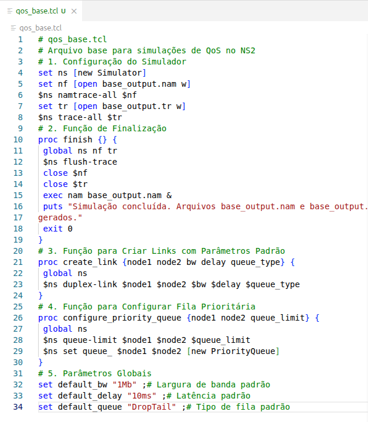
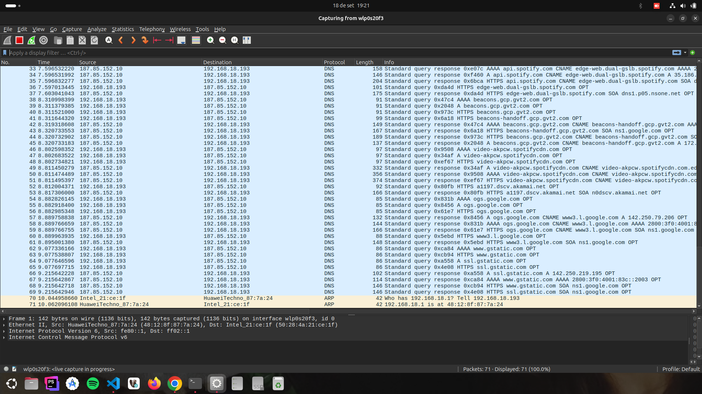
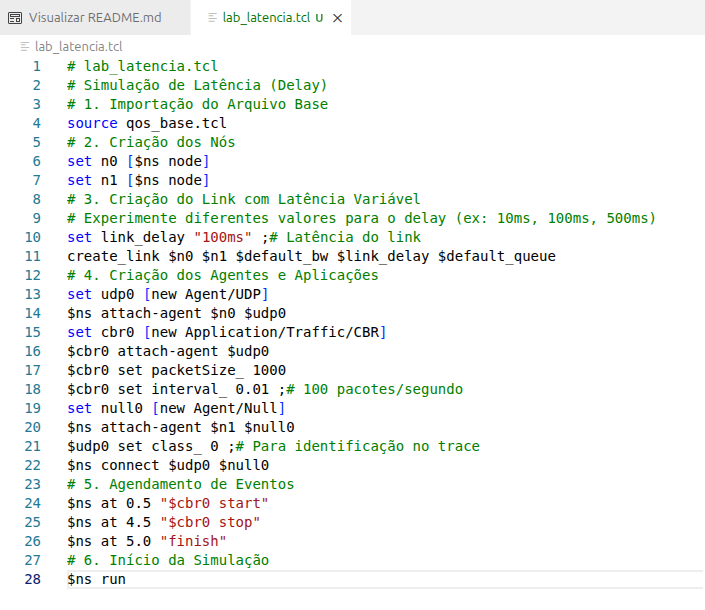
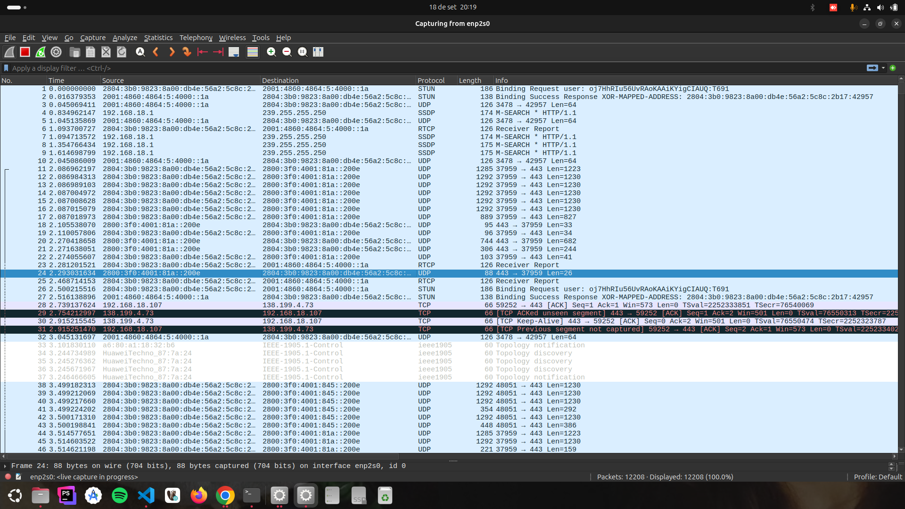
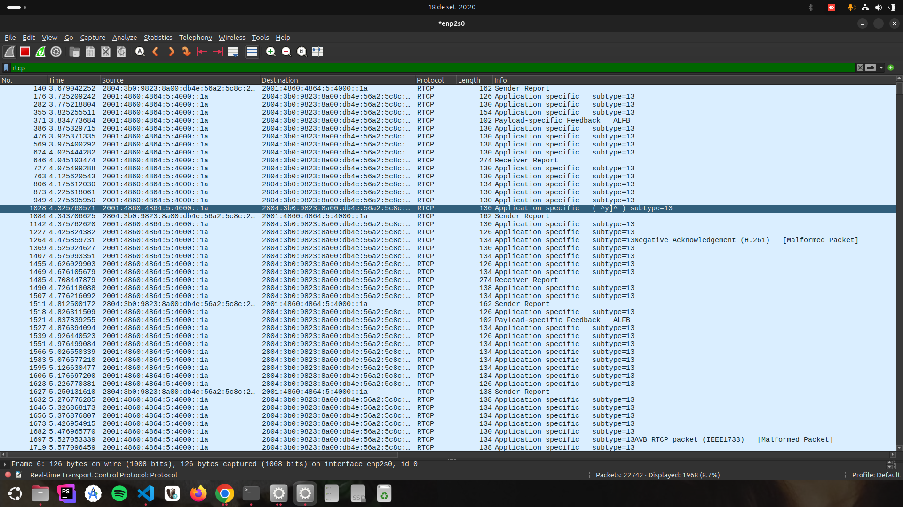
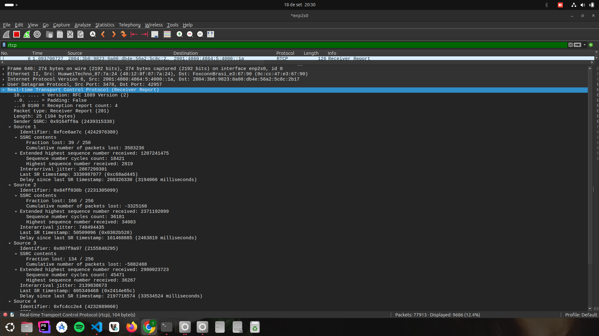
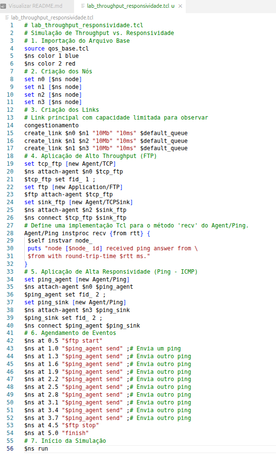
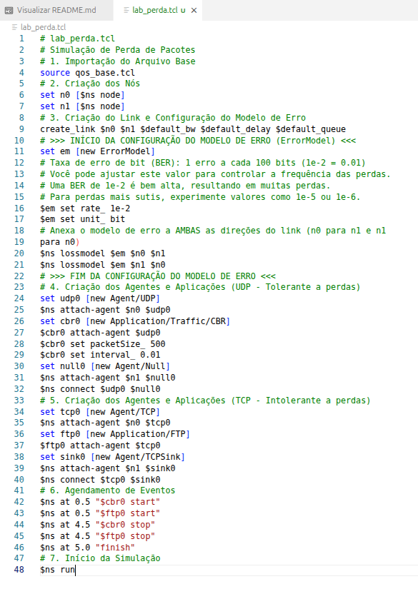

# Relatório de Laboratório: Qualidade de Serviço (QoS) - A Otimização da Jornada dos Pacotes

**Disciplina:** Redes de Computadores II
**Professora:** Angelita Rettore de Araujo

**Nome do Aluno:** Maicon de Oliveira da Silva

**Turma:** Ciência da Computação 2023

---

## 1. Introdução

Este laboratório aborda a **Qualidade de Serviço (QoS)**, um conjunto de mecanismos importantes para gerenciar o tráfego de rede e assegurar que aplicações críticas recebam tratamento preferencial. Diferente dos laboratórios anteriores que focaram na confiabilidade (garantir que os pacotes cheguem), o objetivo aqui é garantir que os pacotes cheguem *com qualidade* – ou seja, com a latência, jitter, throughput e perda de pacotes adequados.

A importância da QoS é contextualizada pela **narrativa da telecirurgia**, onde cada pacote de comando tátil, voz ou dado vital do paciente é crucial. Atrasos, variações irregulares na chegada ou perda de pacotes podem ter consequências catastróficas.

## 2. Objetivos

Os principais objetivos deste laboratório são:
1.  **Compreender e medir** os conceitos fundamentais de Latência, Jitter, Throughput, Perda de Pacotes e Classificação de Tráfego no contexto de QoS.
2.  **Configurar e executar simulações** no **Network Simulator 2 (NS2)** para observar o comportamento da rede sob diferentes condições de QoS.
3.  **Utilizar o Wireshark** para capturar e analisar o tráfego de rede, medindo parâmetros de QoS em tempo real.
4.  **Analisar o impacto** da variação dos parâmetros de QoS no desempenho de diferentes tipos de aplicações.
5.  **Comparar a tolerância a perdas e a sensibilidade à latência e jitter** de diversas aplicações.
6.  **Propor soluções** baseadas em QoS para otimizar o desempenho de aplicações críticas em cenários de rede desafiadores.

## 3. Ferramentas Utilizadas

*   **Network Simulator 2 (NS2)**: Ambiente de simulação de rede para modelar cenários.
*   **Wireshark**: Analisador de protocolo de rede para captura e inspeção de pacotes em tempo real.
*   **Acesso à Internet**: Para testes com ferramentas online (como Google Meet).

---

## 4. Parte I: Relembrando a Jornada – Preparando o Ambiente

**Contexto Teórico:** A narrativa da cirurgia remota é a base para entender a importância dos "pacotes heróis" (Pablo, Melody, Flash e Data) e como a QoS é vital para a missão deles de salvar uma vida.

### **4.1. Verificação e Configuração Inicial do NS2**

*   Confirmei a instalação do NS2 e criei o arquivo `qos_base.tcl`.

**Entrega:** Captura de tela do `qos_base.tcl` no editor de texto.




### **4.2. Configuração Inicial do Wireshark**

*   Abri o Wireshark e selecionei a interface de rede correta para captura.

**Entrega:** Captura de tela do Wireshark com a interface de captura selecionada.



## 5. Parte II: Latência (Delay) – O Tempo é Essencial

**Contexto Teórico:** A latência é o tempo que um pacote leva para ir da origem ao destino, como o tempo para o comando tátil do Dr. Martinez (Flash) chegar ao bisturi em Manaus.

### **5.1. Simulação de Latência no NS2**

*   Criei e executei o script `lab_latencia.tcl`, experimentando diferentes valores para `link_delay` (ex: 10ms, 100ms, 500ms).

**Entrega:** O código `lab_latencia.tcl` utilizado.


### **5.2. Análise da Latência no Arquivo de Trace (.tr)**

*   Analisei o arquivo `lab_latencia.tr`, identificando o envio e recebimento de pacotes para calcular a latência de ponta a ponta.

**Entrega:** Trecho do arquivo `.tr` destacando um pacote enviado e seu respectivo recebimento.
```
+ 0.5 0 1 cbr 1000 ------- 0 0.0 1.0 0 0
- 0.5 0 1 cbr 1000 ------- 0 0.0 1.0 0 0
+ 0.51 0 1 cbr 1000 ------- 0 0.0 1.0 1 1
- 0.51 0 1 cbr 1000 ------- 0 0.0 1.0 1 1
+ 0.52 0 1 cbr 1000 ------- 0 0.0 1.0 2 2
- 0.52 0 1 cbr 1000 ------- 0 0.0 1.0 2 2
+ 0.53 0 1 cbr 1000 ------- 0 0.0 1.0 3 3
- 0.53 0 1 cbr 1000 ------- 0 0.0 1.0 3 3
+ 0.54 0 1 cbr 1000 ------- 0 0.0 1.0 4 4
- 0.54 0 1 cbr 1000 ------- 0 0.0 1.0 4 4
+ 0.55 0 1 cbr 1000 ------- 0 0.0 1.0 5 5
- 0.55 0 1 cbr 1000 ------- 0 0.0 1.0 5 5
+ 0.56 0 1 cbr 1000 ------- 0 0.0 1.0 6 6
- 0.56 0 1 cbr 1000 ------- 0 0.0 1.0 6 6
+ 0.57 0 1 cbr 1000 ------- 0 0.0 1.0 7 7
- 0.57 0 1 cbr 1000 ------- 0 0.0 1.0 7 7
+ 0.58 0 1 cbr 1000 ------- 0 0.0 1.0 8 8
- 0.58 0 1 cbr 1000 ------- 0 0.0 1.0 8 8
+ 0.59 0 1 cbr 1000 ------- 0 0.0 1.0 9 9
- 0.59 0 1 cbr 1000 ------- 0 0.0 1.0 9 9
+ 0.6 0 1 cbr 1000 ------- 0 0.0 1.0 10 10
- 0.6 0 1 cbr 1000 ------- 0 0.0 1.0 10 10
r 0.608 0 1 cbr 1000 ------- 0 0.0 1.0 0 0
+ 0.61 0 1 cbr 1000 ------- 0 0.0 1.0 11 11
- 0.61 0 1 cbr 1000 ------- 0 0.0 1.0 11 11
r 0.618 0 1 cbr 1000 ------- 0 0.0 1.0 1 1
+ 0.62 0 1 cbr 1000 ------- 0 0.0 1.0 12 12
- 0.62 0 1 cbr 1000 ------- 0 0.0 1.0 12 12
r 0.628 0 1 cbr 1000 ------- 0 0.0 1.0 2 2
+ 0.63 0 1 cbr 1000 ------- 0 0.0 1.0 13 13
- 0.63 0 1 cbr 1000 ------- 0 0.0 1.0 13 13
r 0.638 0 1 cbr 1000 ------- 0 0.0 1.0 3 3
+ 0.64 0 1 cbr 1000 ------- 0 0.0 1.0 14 14
- 0.64 0 1 cbr 1000 ------- 0 0.0 1.0 14 14
r 0.648 0 1 cbr 1000 ------- 0 0.0 1.0 4 4
+ 0.65 0 1 cbr 1000 ------- 0 0.0 1.0 15 15
- 0.65 0 1 cbr 1000 ------- 0 0.0 1.0 15 15
```

**Cálculos da Latência:**

| `link_delay` Configurado | Timestamp Envio | Timestamp Recebimento | Latência Calculada |
| :----------------------- | :-------------- | :-------------------- | :----------------- |
| 10ms   | 0.5s         | 0.518s               | 18ms        |
| 100ms  | 0.5s         | 0.608s               | 108ms        |
| 500ms  | 0.5s         | 0.708s               | 208ms        |

### **5.3. Perguntas para Refletir e Discutir**

1.  **Qual a relação entre o `link_delay` configurado no script e a latência medida no arquivo `.tr`?**
    *   O link_delay é o principal fator da latência total que medimos no arquivo .tr em questão (10ms, 100ms e 500ms, respectivamente). Basicamente, se trata do atraso de propagação, que é o tempo de viagem puro em que um sinal leva para viajar entre um ponto e outro da rede. Entretanto, não é o único fator que influencia na latência medida. A latência total inclui, além do link_delay, o atraso de transmissão e o atraso de fila. Isso foi demonstrado no experimento, onde um link_delay de 100ms resultou em uma latência medida de 108ms. Essa diferença de 8ms é justificada pelo atraso de transmissão, provando que a latência final é, de fato, a soma desses componentes.
2.  **Como a latência afeta a percepção do usuário em aplicações como VoIP ou jogos online?**
    *   A latência interfere diretamente o usuário em aplições como VoIP e jogos online, afinal, ambos dependem de interações em tempo real. Em chamadas de voz ou video-chamadas uma latência elevada compromete a experiência, pois resulta em um atraso que quebra o fluxo natural de uma conversa, o que pode resultar em interrupções ou até usuários falando ao mesmo tempo. Em jogos online o impacto mais comum é o "lag", resultado de uma alta latência, o qual quebra o fluxo de interação do jogador com a resposta visual, o que pode tornar o jogo irresponsível e injusto.
3.  **Se o Dr. Martinez estivesse em Tóquio e o paciente em Manaus, qual seria o impacto na latência?**
    *   O impacto seria enorme, e pensando no contexto em que a conexão estaria sendo aplicada, tornaria a atividade impraticável. O principal fator seria o link_delay, que é diretamente proporcional à distância da conexão. Para o Dr. Martinez ter um controle preciso e responsivo, precisaria de um feedback de suas ações, o que significa que envolveria o tempo de latência de ida e volta da conexão. Um atraso dessa proporção tornaria a operação perigosa e inviável.

---

## 6. Parte III: Jitter e Perda de Pacotes – A Variação Inesperada e o Preço da Imperfeição

**Contexto Teórico:** **Jitter** é a variação no atraso dos pacotes, causando "voz robotizada" (pacotes de Melody). A **perda de pacotes** ocorre quando um pacote não chega, sendo a tolerância variável por aplicação (pacotes de Data). O **RTCP (Real-Time Control Protocol)** é utilizado por aplicações em tempo real (como Google Meet) para reportar a qualidade da transmissão, incluindo jitter e perda.

### **6.1. Análise do Jitter e Perda de Pacotes no Wireshark (Captura Local de RTCP)**

*   Iniciei uma chamada no Google Meet e capturei o tráfego com o Wireshark.
*   Filtrei o tráfego por `rtcp` e identifiquei os tipos de pacotes (SR, RR, SDES, Bye).
*   Analisei os **Receiver Reports (RR)** para localizar os campos `Fraction Lost`, `Cumulative Number of Packets Lost` e `Interarrival Jitter`.

**Entregas:**

1.  Captura de tela do Wireshark mostrando a captura inicial de pacotes.

2.  Captura de tela do Wireshark mostrando o filtro `rtcp` aplicado.

3.  Captura de tela dos detalhes de um pacote **Receiver Report (RR)**, com os campos `Fraction Lost`, `Cumulative Number of Packets Lost` e `Interarrival Jitter` claramente visíveis.


**Valores Observados:**

*   **Interarrival Jitter:** 2867299301 (Valor em unidades de timestamp do RTCP)
*   **Fraction Lost:** 39 / 256 (15.2%)
*   **Cumulative Number of Packets Lost:** 3,583,236

### **6.2. Perguntas para Refletir e Discutir**

1.  **Como esses valores de Jitter e Fraction Lost se comparam aos limites aceitáveis para uma boa qualidade de voz/vídeo (ex: jitter idealmente abaixo de 30ms, perda abaixo de 1%)?**
    *   Analisando os valores do Source 1, o Fraction Lost mostra um valor de 15,2%, que é totalmente catastrófico comparado ao limite ideal de 1%. Uma perda desse tamanho resulta em uma comunicação com áudio cortando, vídeo congelando e de baixa qualidade. O valor de Interarrival Jitter é muito elevado, significando que os pacotes que chegam o fazem de forma desorganizada e com grandes variações de tempo. Podemos constar que a captura representa uma rede bem congestionada e instável.
2.  **Por que o RTCP é essencial para aplicações em tempo real, mesmo que o RTP (dados de mídia) esteja criptografado?**
    *   É essencial para aplicações em tempo real, pois atua como um canal de controle e feedback da qualidade de transmissão. É uma função complementar ao RTP, o qual apenas garante a privacidade dos dados, mas não oferece nenhuma informação sobre as condições da conexão. O RTCP ajuda o emissor a saber informações sobre como dados estão chegando ao destino. A partir desses dados capturados, a aplicação pode tratar dinâmicamente os dados a serem transmitidos, como por exemplo no Google Meet, que tende a reduzir a qualidade do vídeo para descongestionar a transmissão, ou até aplicar correção de erros.
3.  **Como as informações de jitter e perda de pacotes reportadas pelo RTCP podem ser usadas pela aplicação (Google Meet) para ajustar a qualidade da transmissão?**
    *   Quando o Google Meet recebe as informações do RTCP que indicam que a perda de pacotes ou o jitter estão aumentando, ele interpreta como um sinal de congestionamento ou instabilidade na rede. Em nível de aplicação, diversas estratégias podem ser utilizadas para reduzir a carga sobre a rede, Entre as mais percpíveis pelo usuário: Diminuição na qualidade do vídeo, redução na taxa de quadros, aumento na compressão da imagem. Para níveis de menor percepção, a aplicação pode trocar o codec de áudio ou utilizar de algorítmos que tratam erros. Por fim, o essencial e mais importante uma chamada sempre será a fluidez na interação.

---

## 7. Parte IV: Throughput vs. Responsividade – O Dilema da Rede

**Contexto Teórico:** **Throughput** é a quantidade de dados em um tempo (Pablo/vídeo HD), enquanto **responsividade** é a rapidez da resposta (Flash/comando tátil). Nem sempre é possível ter ambos em níveis máximos simultaneamente.

### **7.1. Simulação de Throughput e Responsividade no NS2**

*   Criei e executei o script `lab_throughput_responsividade.tcl`, comparando o comportamento de FTP (alto throughput) com Ping (alta responsividade).

**Entrega:** O código `lab_throughput_responsividade.tcl` utilizado.

### **7.2. Análise do Throughput e Responsividade**

*   Analisei o arquivo `lab_throughput_responsividade.tr` para calcular o throughput do FTP e a latência de cada ping.

**Cálculos Detalhados do Throughput do FTP:**
*   Número de pacotes TCP recebidos: [Valor]
*   Tamanho do pacote TCP (padrão NS2): 512 bytes (ou especifique se diferente)
*   Tempo total da simulação para FTP (stop - start): [Valor] segundos
*   Throughput = (Número de pacotes * Tamanho do pacote) / Tempo
*   Throughput (em Kbps/Mbps): [Resultado]

**Cálculos da Latência para cada pacote Ping e Impacto do FTP:**

| Ping Nº | Timestamp Envio | Timestamp Recebimento | Latência (ms) | Observações sobre o Impacto do FTP |
| :------ | :-------------- | :-------------------- | :------------ | :--------------------------------- |
| 1       | 1.0s            | 1.0410s               | 41.0 ms       | Impacto mínimo, adicionando 1ms à latência base |
| 2       | 1.3s            | 1.3406s               | 40.6 ms       | Latência muito próxima do valor ideal de 40ms |
| 3       | 1.6s            | 1.6403s               | 40.3 ms       | A rede não apresentou sinais de congestionamento |
| 4       | 1.9s            | 1.9402s               | 40.2 ms       | Chegou na sua latência mais baixa |
| 5       | 2.2s            | 2.2402s               | 40.2 ms       | A latência do ping permaneceu estável e baixa |
| 6       | 2.5s            | 2.5402s               | 40.2 ms       | A resposta continuou rápida e consistente |
| 7       | 2.8s            | 2.8404s               | 40.4 ms       | Houve uma pequena variação na latência |
| 8       | 3.1s            | 3.1408s               | 40.8 ms       | A latência aumentou um pouco, mas continuou baixa |
| 9       | 3.4s            | 3.4402s               | 40.2 ms       | A latência retornou ao seu valor mais baixo |
| 10      | 3.7s            | 3.7402s               | 40.2 ms       | Continuou em seu valor mais baixo |

### **7.3. Perguntas para Refletir e Discutir**

1.  **Qual aplicação (FTP ou Ping) é mais sensível à latência? Por quê?**
    *   O ping em sua essência é utilizado para medir o tempo de resposta de uma conexão, ou seja, um alto valor de latência em um teste de ping é um mal sinal. Por outro lado, o FTP tem o objetivo de transferir grandes volumes de dados e sua eficiência é mediuda pela vazão (throughput), a velocidade geral em que um arquivo inteiro é transferido. Embora uma latência muito alta possa prejudicar a vazão do FTP, no fim o que importa para o usuário é o tempo total do download, não o tempo de ida e volta de cada pacote individualmente.
2.  **Como o throughput do FTP foi afetado pela capacidade do link?**
    *   Sim, foi diretamente afetado pela capacidade de 10mb do link, que funcionou como um teto máximo para a taxa de transferência. A aplicação, a partir do TCP, tentou utilizar toda a largura de banda disponível, fazendo com que a vazão chegasse bem perto desse limite. Entretanto, em situações reais a vazão é sempre inferior a capacidade do link por conta de fatores do funcionamento dos protocolos de rede. Parte da capacidade é consumida pelos dados dos cabeçalhos dos pacotes, envio de ACKs no sentido contrário, além de outros fatores operacionais da rede.
3.  **Em um cenário de telecirurgia, qual seria a prioridade: alto throughput para o vídeo HD (Pablo) ou alta responsividade para os comandos do bisturi (Flash)? Justifique.**
    *   Acredito que a prioridade seria a alta responsividade para os comandos do bisturi, afinal, as consequencias que uma interação sem precisão e confiabilidade podem custar a vida do paciente. Por mais que a alta vazão seja desejável para ter uma melhor visualização, se o vídeo ficar com a qualidade temporariamente reduzida, mas com baixa latência para a realização dos comandos ainda seria possível realizar o procedimento, mas não o inverso. A escolha sempre será pela intergridade do paciente.

---

## 8. Parte V: Perda de Pacotes – O Preço da Imperfeição

**Contexto Teórico:** A perda de pacotes ocorre quando um pacote não chega ao destino. A tolerância a essa perda varia drasticamente entre as aplicações, como os dados vitais do paciente (Data).

### **8.1. Simulação de Perda de Pacotes no NS2**

*   Criei e executei o script `lab_perda.tcl`, ajustando a taxa de erro de bit (`rate_`) para diferentes valores (ex: 1e-2, 1e-5) no `ErrorModel`.

**Entrega:** O código `lab_perda.tcl` utilizado.


### **8.2. Análise da Perda de Pacotes no Arquivo de Trace (.tr)**

*   Analisei o arquivo `lab_perda.tr` para calcular a taxa de perda de pacotes UDP e observar o comportamento do TCP.

**Cálculos da Taxa de Perda de Pacotes UDP:**

| `rate_` Configurado (ErrorModel) | Pacotes UDP Enviados | Pacotes UDP Recebidos | Pacotes Perdidos | Taxa de Perda (%) |
| :------------------------------- | :------------------- | :-------------------- | :--------------- | :---------------- |
| e.g., 1e-2           | 400              | 291               | 109          | 27.25%       |
| e.g., 1e-5          | 400              | 385               | 15          | 3.75%       |

**Descrição do Comportamento do TCP:**
*   A análise de um ambiente com alta perda de pacotes mostra claramente a principal diferente entre o UDP e o TCP. O UDP mostrou o comportamento de enviar e esquecer os pacotes, que foram descartados pelo ErrorModel e sem qualquer tentativa de os recuperar. O resultado é que a aplicação do UDP com uma alta perda de pacotes, ao depender do contexto, pode tornar a informação recebida incoerente e possivelmente inútil. Já o TCP, que também sofre com descartes, utilizou de seus mecanismos de confiabilidade, que pode ser confirmado com o trace mostrando um fluxo constante de ACKs do receptor para o emissor. Esse recurso, que por mais que torne o desempenho menor, garante que os dados sejam transmitidos de forma íntegra e confiável.

### **8.3. Perguntas para Refletir e Discutir**

1.  **Qual protocolo (UDP ou TCP) é mais afetado pela perda de pacotes em termos de entrega final? Por quê?**
    *   Pensando na informação final, o UDP é infinitamente mais prejudicado, e isso se deve a filosofia de cada protocolo. O UDP não possui nenhum mecanismo de confirmação de recebimento de pacotes ou de retransmissão, ou seja, quando se perde uma vez, para sempre ficará uma lacuna na entrega final. Por outro lado, o TCP foi projetado para ser confiável neste mesmo sentido. Embora a performance seja prejudicada pela perda de pacotes, a sua entrega final não é. O TCP utiliza de ACKs para rastrear cada pacote, e quando um se perde, ele é reenviado até que o receptor confirme ser recebimento. Ou seja, o UDP entrega a informação com lacunas e sem qualquer garantia de confiabilidade, enquanto o TCP garante a entrega de dados completos, ordenados e sem erros.
2.  **Como a taxa de perda configurada no script (`rate_`) se compara à taxa de perda observada para o UDP?**
    *   A taxa de perda observada na simulação foi bem superior à taxa de erro configurada no script. Isso ocorre porque a relação entre o erro de bit e a perda de pacote é exponencial, não linear. Ou seja, para que um pacote seja recebido com sucesso, todos seus milhares de bits devem chegar intactos.
3.  **Dê exemplos de aplicações que toleram alta perda de pacotes e aplicações que não toleram nenhuma perda.**
    *   Exemplos que toleram: 
        - Streaming de vídeo e áudio: Neste contexto, se um pacote se perde pode resultar apenas em um defeito na pixelização da imagem por um tempo muito curto, ou uma pequena falha em um áudio. Para o usuário faz muito mais sentido uma experiência fluida à garantia de que os pacotes chegem com perfeição.
        -Chamadas de voz e vídeo: A conversação humana tolera lacunas na audição, mas por outro lado, a latência tiraria a naturalidade da interação.
        -Jogos online: Em um jogo que tem seu estado mudado dezenas de vezes por segundo, todo o custo para receber os pacotes com perfeição resultará em "lag" e em uma experiencia frustrante.

    *   Exemplos que não toleram: 
        - Transferência de arquivos: Perder um único pacote durante a transferência de um arquivo pode corrompê-lo por inteiro, o tornando inútil.
        - Carregamento de páginas Web: Os códigos presentes em uma página web (HTML, CSS, JS) devem ser iguais aos originais, para que o navegador possa renderizar corretamente. Um só pacote perdido pode resultar em uma página quebrada e sem funcionalidade
        - Transações financeiras: Se trata de um contexto de confiabilidade critica. Não se pode perder pacotes que contém valores de uma transferência bancária, a integridade da transação deve ser garantida.

---

## 9. Parte VI: Consolidação e Perspectivas Futuras

### **Síntese do Aprendizado**

*   Este laboratório me fez aprender de maneira prática que a Qualidade de Serviço é um conceito maleável dentro da rede, pois é aplicado em diferentes métricas e contextos, quais tem diferentes importâncias conforme sua aplicação. Os experimentos que revelaram que aplicações em tempo real são geridas pela latência e pelo jitter, onde qualquer alteração na entrega dos pacotes pode alterar na experiência do usuário. Em contrapartida, aplicações de transferência de dados em massa são dependentes da vazão(throughput) e mais tolerantes a atrasos, desde que não sejam altos de maneira geral. Por fim, vimos que a perda de pacotes podem ter um impacto distindo, enquanto no UDP corrompe de forma definitiva a entrega final da informação, no TCP ele "apenas" compromente a performance. 

* O laboratório se encaixou perfeitamente com a narrativa da telecirurgia. Os comandos do Dr. Martinez e os dados do paciente representam fluxos criticos, onde a baixa latencia, baixo jitter e a zero perda de pacotes são questões de segurança do paciente. Já o video em alta qualidade, por mais que importante, é um fluxo que mais demanda de vazão, mas que pode ter uma queda momentânea de qualidade. Em uma rede sem QoS, o enorme volume de dados do vídeo congestionaria o link, aumentandio a latencia e a perda de pacotes, compromentendo a vida do paciente.

* A solução deste problema baseada em QoS é um cenário desafiador, pois não depende unicamente de implementações técnicas, mas principalmente em políticas de classificação e priorização do tráfego.
---

**Instruções Finais para os Alunos:**
*   Preencha todas as seções marcadas com `[ ]` com suas informações e análises.
*   Converta este arquivo Markdown para PDF para a entrega final, garantindo que todas as imagens e formatações estejam corretas.

---